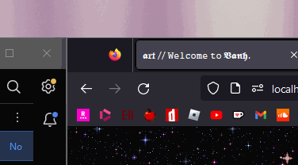
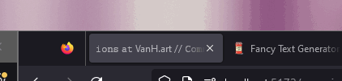
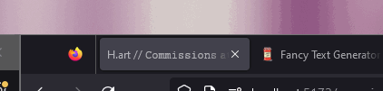

# titleScroller.js
Everything you need to build a Svelte project with a scrolling titlebar animation.

This project is a demonstration of string parser that is compatible with 2-part unicode characters
which scrolls around it's entirety on the page tab at the top of the browser.



#### NOTE:
Please be assured this functionality does not require Svelte to function, but is used for a use case
to help with displaying reactivity to page changes and loading.

## How to launch:
Open the directory via `cd /d {parentRoot}/titleScroller.js`
install the required libs with `npm install` 
and run via the development build `npm run dev`


## So, why use this?

By default, because of unique unicode characters being two-part characters, you require a parser to deal 
with them; Here's an example of how double-character unicode will display otherwise:



And here's what it looks like with the fix;



## How to use:
On route change, set the writable `$pageName` to the new directory name, this changes the route name.
When changing the route name, it'll reset the array offset and restart the loop.
I would advise building a pre-designed object array with all the page names, url and button title for 
the simplest back-end implementation.

You can preview the functionality with my website www.vanh.art.

## How it works
Every time a page is transitioned, this will be the steps we go through to generate the timing required
to scroll;
- Cleans the current ongoing 250ms loop.
- two variables are created, an array to be used to create the offsets `headerArray` and `headerString`.
- Once we have the two reference points of the same value, we then push to the `unicodeArrFragmenter`.
  - the string is parsed and is now a raw unicode value, it's put into a loop each character of the array
    is then checked. If the string is longer than 2, we know it's not a generic keyboard character.
  - The length will be put aside in an array of timings to be used parallel to our regular string, and
    will determine if we should skip 1 or 2 characters, depending on the length of the next character.
    This retains the entire character as one singular symbol.
- We quickly parse the string to an array so we can then shift it later when the function is called.
- A timer is then set to call the update function, which will loop every 250ms until the function is called
  again.

The new string can then be parsed properly from resulting variables.
What we now have is an array of offsets depending on if the unicode character in the string is 2 or
1 characters long, and the string we want to offset.
Every 250s, a new "frame" of the scroll animation will be done, which we then use the parallel offset to.

Eg. A character such as "𝕸" has two unicode characters; `d835`, `de86`. To keep the integrity of the letter
when shifting the character array, you shift it twice, whereas a letter like "M" is a single character.

```js
let parsedUnicode = rawParse[i].charCodeAt(0).toString(16).toUpperCase();
if (parsedUnicode.length > 2){
    // characters that are not typical 1 character long unicodes.
}
```

The main functionality of the code is in `titlebarScroller.js`. However you call the functionality is 
upto you.

### Words of note

For those of you who just want to have this functionality but don't know how to use it, 
The beauty of the setup is that all you *really* have to do is **call** the function.

Here's a more raw-form example.

```html

<script>
  import {titlebarScroller, pageTitlebar} from "/lib/titlebar.js";
  import {onMount} from "svelte";

  onMount(() => {
    titlebarScroller(`my website name`);
  })

</script>

<svelte:head>
  <title>{pageTitlebar}</title>
</svelte:head>
```
And this will initialize everything for you.

If you use something like Tumblr, it should be pretty easy to strip out the function too.
Copy and paste the `titlebarScroller` function and all the other functions it calls, plug it at 
the top of your page script. Then, remove all the writables and `$` at the start of all vars that
do so, it *should* do the trick.

